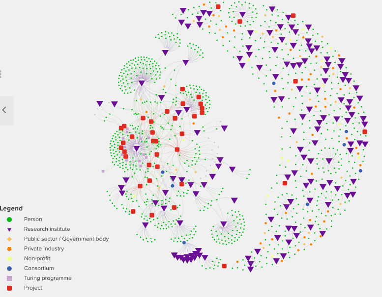
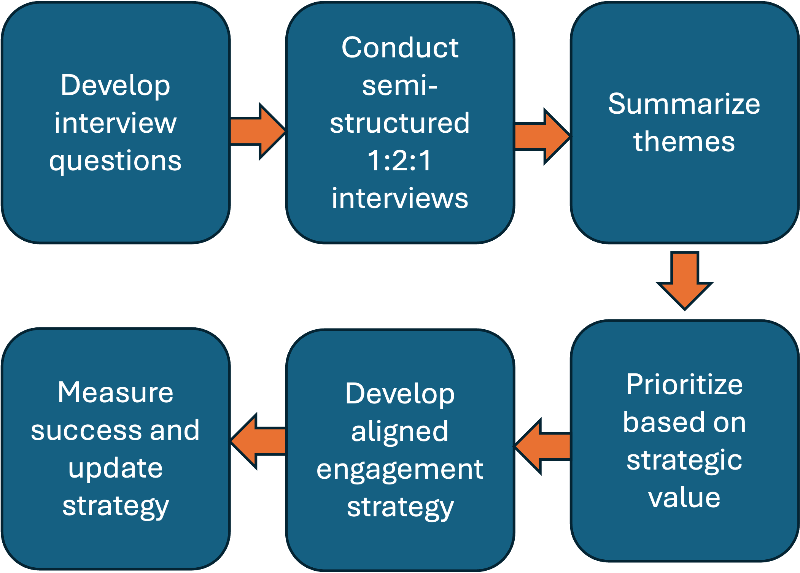
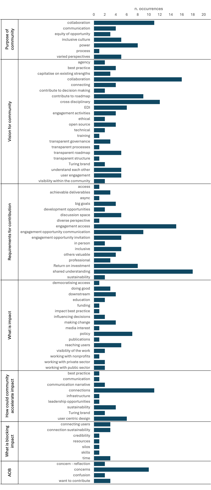

# E&S Community Strategy

<mark>*** All material in this repository is shared as a work in progress. Some material may be missing, under review, or no longer in scope. Please  [contact the E&S Senior Research Community Manager](./CONTRIBUTING.md) if you have questions about reuse or contribution. *** </mark>

<!-- ## Objective: Community strategy
### Category: Reinforcing the role of the Institute as a national body in the UK and International landscape
### Target date: 28th June
### Activity
- Use systematic stakeholder mapping to record/identify stakeholders in the E&S GC across all sectors, and classify them according to engagement and community readiness.
- Create visual map representations of the community for analysis and communication.
- Develop strategy for growth in targetted areas.
- Engage with both national and international stakeholders.
- Ensure the strategy is aligned with internal and project activities.

### Value
An effective community strategy will enable the design and delivery of impactful activities associated with the E&S GC, which are well-grounded in the needs of the community.

Such a strategy will enable the GC programme to connect with the right people at the right time, and collaborate with them in line with best practice for open, inclusive and reproducible research. This meaningful engagement will add to the sustainability of the GC and community activities through increased stakeholder buy-in and equitable participation.  -->

<!-- **Contents**
1. [Mission, vision, values of the GC](#gc-mission-vision-and-values)
1. [Strategy framework](#strategy-framework)
2. [Diagnosis (baseline)](#diagnosis---baseline-at-the-start-of-the-gc)
3. [Design](#design)
4. [Execute (initiatives)](#execute-initiatives)
5. Empower (embedding the strategy) -->

## GC Mission, vision and values
- Mission of the GC to "integrate data and deploy solutions in a timely manner to help secure our planet for future generations." ([Turing E&S GC website](https://www.turing.ac.uk/research/environment-and-sustainability)) <mark>note this mission need to be stated more explictly on the website and our materials</mark>.

</mark>Working mission: "advance world-class research and apply to real world problems".</mark>

## Strategy framework
The community strategy is a set of principles which can be used to guide decision making and resource allocation within the GC. Development of the strategy and strategic implementation plan will follow the below framework:
1. **Diagnosis** - Understanding the baseline and the unique value proposition of the community. This phase will also uncover and develope measurable features of the community which can later be used to understand the efficacy of the strategy; 
2. **Design** - Developing a mission and vision for the community aligned with the mission of the GC. The community mission, vision and values should be co-designed with, and well understood by, the GC community and delivery team;
3. **Execute** - Develop high-level initiatives and specific measureable actions which will help move the community towards achieving the mission and visions, in alignment with the values; 
4. **Empower** - Boost understanding of the community strategy in the community itself and the delivery team, to make sure that it is integral to decision making and resource allocation. This will include regular reporting against the developed metrics and revision of the implementation strategy where the needs of the community change, the context of operation is significantly altered or initiatives are not successful.

The following documents our progress in developing the strategy against this framework.

## Diagnosis - Baseline at the start of the GC
### Composition of the community 
The E&S GC community broadly consists of the following stakeholder groups:
1. Researchers employed (not all 1.0 FTE) at Turing to conduct or facilitate E&S research activity
2. Individuals who have signalled interest in Turing E&S activities, either by joining the mailing list, slack, or both. Includes Turing Fellows. 
3. Employers or groups otherwise affiliated with the above:
    - Research institutes;
    - Public sector or Government bodies
    - Private industry
    - Nonprofits
    - Consortiums

At 1st January 2024, there were ~400 people on TIG the mailing list and ~600 on slack, but no estimate of overlap or understanding in relation to clusters of interest. Hence there was no accurate way to baseline the community or understand the efficacy of any community strategy (for example to grow or engage with researchers). 

In January-March 2024, frameworks were developed to collate stakeholders and their projects and present them in an actionable and communicable format (figure 1). Projects were included as this is a primary means to identify collaboration, opportunities and routes to disseminate best practice.

Figure 1. Stakeholder map

### Community health
At the start of the GC, there was no framework for measuring community health. 

In the RCM team, we consider "commmunity health" to cover factors such as number of members, engagement level, degree of contribution and trust within the community. We can also consider factors such as community-initiated collaboration or organisation into interest groups as indicators of autonomy (self-organising to serve the interests of the community) and sustainability of the community. These factors are considered and against the a "mountain of engagement" model, developed by Mozilla and shared via [Open Life Sciences](https://openlifesci.org). 

We can also undertake formal Social Network Analysis using kumu <mark>add detail about kumu analysis metrics</mark>

### Community needs
We need to understand the priorities of our community, what they care about and what infrastructure we can develop to support and facilitate their success. We also need to understand areas where the E&S GC can provide additionality and plug gaps, to further the growth of this ecosystem.

#### Method
To do this, we need to know who the community are and what messaging and processes we should use to engage with them. This understanding can be built using formal qualitative analysis. A suitable methodology for a new community such as this is [Grounded Theory](https://en.wikipedia.org/wiki/Grounded_theory) development and analysis of 1-2-1 interviews, with interview questions guided by the mission of the GC to "advance world-class research and apply to real world problems".

The following interview questions were devised over the course of four interviews with researchers and Turing Fellows. The final (AOB) question was included for all participants to ensure that they had an opportunity to share any interest, issues or concerns which were pertinent to them.

1. What is the purpose of community?
2. What is your vision for E&S GC community (North Star)?
3. What would you need in place to contribute (in both directions), or what would stop you contributing?
4. What is impact?
5. How could this community accelerate your impact?
6. What is a priority concern/blocker for you in delivering impact in the E&S space?
7. Any questions you would have liked me to ask? (AOB)

A further 38 individuals were then invited to attend a one-to-one interview with the composition selected to cover the diversity of stakeholder groups and contributor types. As of 12th July 2024, 14 interviews have been completed and analysed for themes emerging under each question. 

#### Results
A record of [invited and interviewed participants is available to Turing staff here](https://thealanturininstitute-my.sharepoint.com/:x:/g/personal/cgouldvanpraag_turing_ac_uk/EWrKCeTtSQxDrwqnozsQLd8BT_lV4VESRhV-ZPp9vzKJNQ?e=M0HFNi).

[Notes capturing the content of the interview discussion is available to the GC team here](https://github.com/alan-turing-institute/environment-and-sustainability-gc-team/blob/main/meeting-notes/meeting-community-strategy-121.md).

[Interview summaries and identified themes are available to Turing members here](https://thealanturininstitute-my.sharepoint.com/:x:/g/personal/cgouldvanpraag_turing_ac_uk/ER7_9YLhYtJNoxfRSW37fVQBUdW8L7pi0EixGGNn58GHqA?e=rl1cYX), coded with the participant stakeholder group and mountain of engagement level. Data are formatted for import to Kumu to create the visualisation. 

Themes identified are shown below in map (figure 2) and histogram form (figure 3) with frequency of occurrences of each theme over all interivews.  Note in formal Grounded Theory analysis, data collection would continue until the themes are saturated, i.e. new themes are not identified through further interviews. Themes seem to be approaching saturation after 14 interviews, however, further diversification of the sample population may and cover additional priorities and further inference may be made about the degree of priority for each theme based on the frequency of appearance, potentially grouped by stakeholder type or mountain of engagement level.

Figure 2. Map of themes in community needs identified in interview <mark>Turing members can Cass for access to live version of this map. Requires free kumu account.</mark>

Figure 3. Plot of the frequency each theme appeared in interview.

#### Analysis
Below are the most frequently appearing themes under each question. 

##### Purpose of community
<mark>This is how we market the community</mark>
- collaboration
- power
- inclusive culture
- varied perspectives

##### Vision for community
<mark>This is what we look to achieve. This is measured baseline and post activities.</mark>
- foster collaboration (how: RCM training - <mark>Y1/2</mark>)
- cross disciplinary (how: seminar series and other content - <mark>Y1</mark>)
- ways for people to contrubute to the roadmap (show people that we have listened via this work)
- inclusivity (EDI) (how: values - <mark>Y1</mark>)
- understand eachother (how: stakeholder map; seminar series etc. "know what others are doing", "know the importance of eachothers work" - <mark>Y1</mark>)
- transparency (how: open source - <mark>Y1</mark>)
- user engagement (how: RAM training, impact framework)

##### Requirements for contribution
<mark>This is how we deliver our activities</mark>
- shared understanding (transparency about stuff)
- engagement access (make our events accessible)
- engagement opportunity communication (make sure we prioritise effective communicate about our activities - this will need resourcing)
- Return on investment (make it low lift or high return; culture change - support, reward, celebrate)
- discussion space (engineer valuable conversation, inc big goals)

##### Impact the community want to make
<mark>These are mostly for RAMs to think about.</mark>

##### Accellerating and blocking impact
- making connections (measure on the SHM, shared events etc.)
- user centric design and connecting to users (RAM)
- connection sustainability (partnerships)

##### AOB
- want to contribute (how: timely delivery of engagement activities; open leadership in engagement activities)
- concerns - disruptive changes and learning from our mistakes (for Marc to address)